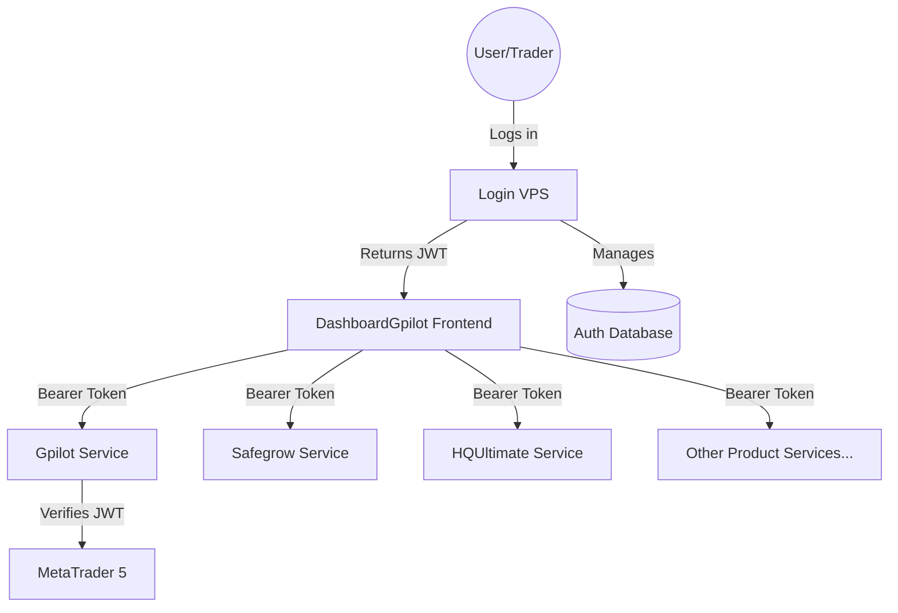

# Architecture Overview — DashboardGpilot Frontend

This document describes the high-level architecture and design decisions for the DashboardGpilot Frontend application.

## 🗺 System Context

The DashboardGpilot Frontend operates in a **Microservice Architecture** where each product operates as an independent service. The dashboard orchestrates these services based on user roles and permissions.



## 🏗 Component Diagram (Folder Structure)

The project follows a **Feature-based Clean Architecture** to ensure separation of concerns and maintainability.

```text
src/
├── app/                        # Next.js App Router (Routing & Pages)
├── features/                   # Feature Modules (Feature UI + Hooks)
│   ├── dashboard/              # Home Overview: Parallel Fetching & RBAC [REFACTORED]
│   ├── product-detail/         # Product Performance Analytics
│   ├── history/                # Trade Logs with Background Sync
│   └── auth/                   # Identity Management
├── shared/                     # Shared cross-feature code
│   ├── api/                    # Infrastructure: API client & Dynamic Endpoints
│   ├── services/               # Application Layer: Service Parameterization & Mocks
│   ├── types/                  # Domain Models & API Types
│   └── mock/                   # Mock Data Fallbacks for non-active services
```

### Layer Responsibility

1. **Presentation Layer (`features/`, `app/`, `shared/ui/`)**: Handles user input and UI rendering.
   - **Feature components**: Specific to a business use case (e.g., `ProfileCard`).
   - **Shared UI**: Universal, reusable components (e.g., `DataTable`, `BalanceChart`).
   - **App Router**: Renders static shell and handles routing.
2. **Application Layer (`shared/services/`)**: Orchestrates the business flow, calls API clients (Infrastructure), and transforms data into Domain-friendly models.
3. **Domain Layer (`shared/types/domain/`)**: Contains pure business entities and rules. No external dependencies.
4. **Infrastructure Layer (`shared/api/`)**: Handles external communication (HTTP fetch), Bearer Token injection from localStorage, error handling, and cross-cutting concerns (logging, tracing).

---

## 🔐 Role-Based Access Control (RBAC)

The application implements a frontend-gated RBAC system to manage product visibility:

| Role | Access Permissions |
| :--- | :--- |
| **Admin** | Access to all products (Gpilot, Safegrow, HQUltimate, PPVP, GoldenBoy) |
| **Role A** | Access to Safe Grow, Gpilot, and HQUltimate |
| **Role B** | Access to PPVP, GoldenBoy, and HQUltimate |

Visibility is controlled via `ROLE_PERMISSIONS` in `DashboardPage.tsx`, ensuring users only see relevant products on their dashboard.

---

## 📡 API Dynamic Routing

To support microservices, the **Infrastructure Layer** (`apiClient`) supports dynamic `serviceBase` paths defined in `endpoint.ts`:

- `SERVICE_BASE_GPILOT`: `/api/gateway/gpilot`
- `SERVICE_BASE_SAFEGROW`: `/api/gateway/safegrow`
- ...and others.

---

## 📊 Key Data Flows

### 1. Dashboard Parallel Fetching

1. `DashboardPage` renders based on user role.
2. Multiple `DashboardCard` components are rendered.
3. Each card independently executes `useProductDetailData(serviceBase)`.
4. Individual **Skeletons** are shown until each independent API request completes.

#### Data Fetching & Caching Layer

The application uses **TanStack Query (React Query) v5** to manage all server state, providing a robust solution for high-concurrency data fetching (up to 20k users).

### Why TanStack Query?
- **SWR Pattern**: Displays cached data immediately while revalidating in the background.
- **Request Deduplication**: Prevents multiple identical requests from hitting the backend simultaneously.
- **Efficient Caching**: Significant reduction in backend load for popular products.

### Configuration Standards
- **staleTime: 60,000ms (1 minute)**: Data is considered fresh for 1 minute.
- **gcTime: 300,000ms (5 minutes)**: Cache remains in memory for 5 minutes after being unused.
- **Query Keys**: Structured as `['feature', params...]` (e.g., `['history', serviceBase, page]`).

### Hook Pattern
Hooks use `useQuery` to wrap async service calls, returning a standardized interface (`loading`, `error`, `data`, `refreshData`).

## Security

### 2. Product Detail & Background Sync

1. User selects a product, navigating to `/product-detail?base=...`.
2. `ProductDetailPage` fetches primary metrics (blocking).
3. Simultaneously, `TradeHistoryService.getHistory()` is triggered in the **background** to update the database state without blocking the UI.

---

## 📡 Observability Strategy

- **Structured Logging**: All logs follow a JSON format for better observability.
- **Trace IDs**: Distributed tracing enabled via `X-Trace-ID` headers across all service calls.

## API Integration & Routing

The system utilizes two distinct backend services which are harmonized via the `apiClient` utility:

### 1. Main Backend (GPilotBackend)
- **Scope**: Account-specific data (Trades, Analytics, History).
- **URL Pattern**: `/api/v1/{accountId}/{endpoint}` (e.g., `/api/v1/gpilot/trades`).
- **Base Path**: `/api/gateway/gpilot`.

### 2. Sub Backend (GpilotBackendSub)
- **Scope**: Global system operations (Auth, Cross-account Sync).
- **URL Pattern**: `/api/v1/{endpoint}` (e.g., `/api/v1/auth/login`).
- **Base Path**: `/api/gateway/sub`.

### Routing Logic
The `apiClient` automatically handle these patterns:
- It detects the `serviceBase` provided.
- For `Main` services, it injects the `accountId` (extracted from the gateway path) into the final API route.
- For `Sub` services, it uses a flat global route.

## Local Development
For local development, `next.config.mjs` uses `rewrites` to proxy gateway paths to the respective local servers (Port 8000 for Main, Port 8001 for Sub).

- **Error Handling**: Standardized `ApiError` class and `ServiceResponse` wrapper ensure consistent error reporting across the application.

---

## 🧪 Testing Strategy

- **Unit Testing**: Vitest is used for testing services, utilities, and hooks.
- **UI Testing**: React Testing Library + happy-dom for component validation.
- **Naming Pattern**: All test cases follow `[MethodName]_[Scenario]_[ExpectedBehavior]`.
- **Target Coverage**: 80% for Domain logic, 70% for Application services.
