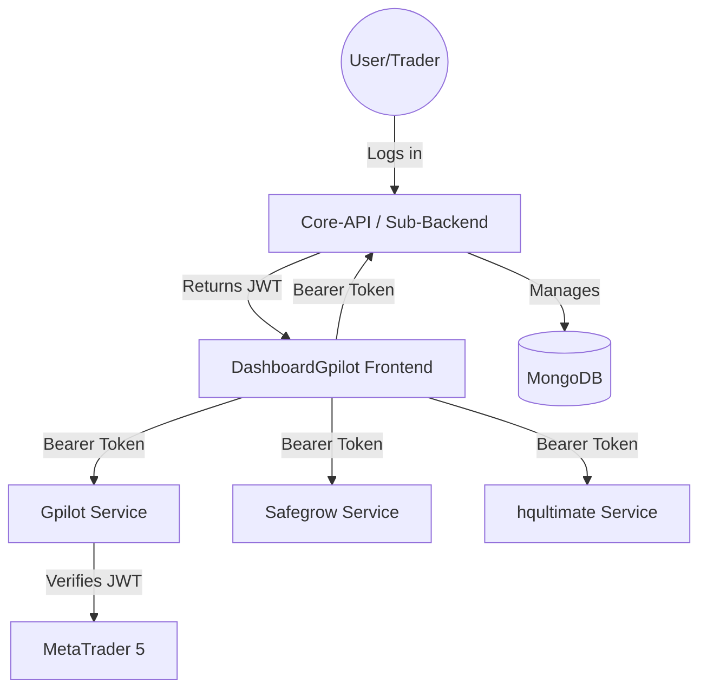

# Architecture Overview — DashboardGpilot Frontend

This document describes the high-level architecture and design decisions for the DashboardGpilot Frontend application.

## 🗺 System Context

The DashboardGpilot Frontend operates in a **Microservice Architecture** where each product operates as an independent service. The dashboard orchestrates these services based on user roles and permissions.



## 🏗 Component Diagram (Folder Structure)

The project follows a **Feature-based Clean Architecture** to ensure separation of concerns and maintainability.

```text
src/
├── app/                        # Next.js App Router (Routing & Pages)
├── features/                   # Feature Modules (Feature UI + Hooks)
│   ├── dashboard/              # Home Overview: Parallel Fetching & RBAC [REFACTORED]
│   ├── product-detail/         # Product Performance Analytics
│   ├── history/                # Trade Logs with Background Sync
│   └── auth/                   # Identity Management
├── shared/                     # Shared cross-feature code
│   ├── api/                    # Infrastructure: API client & Dynamic Endpoints
│   ├── services/               # Application Layer: Service Parameterization & Mocks
│   ├── types/                  # Domain Models & API Types
│   └── mock/                   # Mock Data Fallbacks for non-active services
```

### Layer Responsibility

1. **Presentation Layer (`features/`, `app/`, `shared/ui/`)**: Handles user input and UI rendering.
   - **Feature components**: Specific to a business use case (e.g., `ProfileCard`).
   - **Shared UI**: Universal, reusable components (e.g., `DataTable`, `BalanceChart`).
   - **App Router**: Renders static shell and handles routing.
2. **Application Layer (`shared/services/`)**: Orchestrates the business flow, calls API clients (Infrastructure), and transforms data into Domain-friendly models.
3. **Domain Layer (`shared/types/domain/`)**: Contains pure business entities and rules. No external dependencies.
4. **Infrastructure Layer (`shared/api/`)**: Handles external communication (HTTP fetch), Bearer Token injection from localStorage, error handling, and cross-cutting concerns (logging, tracing).

---

## 🔐 Role-Based Access Control (RBAC)

The application implements a frontend-gated RBAC system to manage product visibility:

| Role | Access Permissions |
| :--- | :--- |
| **Admin** | Access to all products (Gpilot, Safegrow, hqultimate, PPVP, GoldenBoy) |
| **Role A** | Access to Safe Grow, Gpilot, and hqultimate |
| **Role B** | Access to PPVP, GoldenBoy, and hqultimate |

Visibility is controlled via `ROLE_PERMISSIONS` in `DashboardPage.tsx`, ensuring users only see relevant products on their dashboard.

---

## 📡 API Dynamic Routing

To support microservices, the **Infrastructure Layer** (`apiClient`) supports dynamic `serviceBase` paths defined in `endpoint.ts`:

- `SERVICE_BASE_GPILOT`: `/api/gateway/gpilot`
- `SERVICE_BASE_SAFEGROW`: `/api/gateway/safegrow`
- ...and others.

---

## 📊 Key Data Flows

### 1. Dashboard Parallel Fetching

1. `DashboardPage` renders based on user role.
2. Multiple `DashboardCard` components are rendered.
3. Each card independently executes `useProductDetailData(serviceBase)`.
4. Individual **Skeletons** are shown until each independent API request completes.

#### Data Fetching & Caching Layer

The application uses **TanStack Query (React Query) v5** to manage all server state, providing a robust solution for high-concurrency data fetching (up to 20k users).

### Why TanStack Query?
- **SWR Pattern**: Displays cached data immediately while revalidating in the background.
- **Request Deduplication**: Prevents multiple identical requests from hitting the backend simultaneously.
- **Efficient Caching**: Significant reduction in backend load for popular products.

### Configuration Standards
- **staleTime: 60,000ms (1 minute)**: Data is considered fresh for 1 minute.
- **gcTime: 300,000ms (5 minutes)**: Cache remains in memory for 5 minutes after being unused.
- **Query Keys**: Structured as `['feature', params...]` (e.g., `['history', serviceBase, page]`).

### Hook Pattern
Hooks use `useQuery` to wrap async service calls, returning a standardized interface (`loading`, `error`, `data`, `refreshData`).

## Security

### 2. Product Detail & Background Sync

1. User selects a product, navigating to `/product-detail?base=...`.
2. `ProductDetailPage` fetches primary metrics (blocking).
3. Simultaneously, `TradeHistoryService.getHistory()` คือการดึงข้อมูลจาก MT5 มาบันทึกลง MongoDB ใน Backend เพื่อให้ข้อมูลเป็นปัจจุบันที่สุด

### 3. Mandatory Password Change Flow (Security)

1. ผู้ใช้ทำการ Login ครั้งแรกด้วยรหัสผ่านชั่วคราว
2. Backend ตอบกลับมาพร้อมแฟล็ก `requirePasswordChange: true`
3. Frontend (ผ่าน Logic ในหน้า Login หรือ Middleware) ตรวจพบแฟล็กนี้ และทำการ Redirect ผู้ใช้ไปยังหน้า `/change-password`
4. ผู้ใช้ตั้งรหัสผ่านใหม่ → `AuthService.updatePassword(newPass)`
5. เมื่อเปลี่ยนสำเร็จ Backend จะปลดแฟล็กและคืน Access Token ตัวจริงให้ใช้งาน

### 4. Multi-Port Management (1:N Architecture)
- **MT5 Password Updates**: Since users can have multiple MT5 accounts (`Mt5Account`), the frontend `AuthService.updateMT5Password(mt5Id, newPlainPassword)` targets an individual port by supplying the `mt5Id` to the backend, which manages it via a composite identifier (`user_id + mt5_id`).

---

## 🏗 Dual-Layer Data Fetching (Server & Client)

ในโปรเจกต์นี้เราเลือกใช้แนวทาง Hybrid เพื่อดึงจุดเด่นของแต่ละส่วนมาใช้:

1. **Server-side (apiServer)**:
   - **First Load Speed**: ใช้ดึงข้อมูลเริ่มต้น (Initial Data) เพื่อให้ผู้ใช้เห็นเนื้อหาทันทีที่เปิดหน้าเว็บ ลดการเห็น Skeleton หรือหน้าว่าง (SSR)
   - **SEO**: ช่วยให้ Search Engine สามารถเก็บข้อมูลหน้าเว็บได้ครบถ้วน
   - **Security**: การจัดการ Token ผ่าน Server-to-Server ช่วยลดความเสี่ยงจากการถูกโจมตีฝั่ง Client ในช่วงโหลดหน้าแรก

2. **Client-side (apiClient)**:
   - **Interactivity**: ใช้จัดการ Action ต่างๆ (เช่น กดปุ่ม, ส่งฟอร์ม) โดยไม่ต้องรีโหลดหน้าเว็บทั้งหมด (SPA Experience)
   - **Seamless UX**: รองรับระบบ Refresh Token เบื้องหลัง ทำให้ผู้ใช้ที่กำลังใช้งานอยู่ไม่ถูกขัดจังหวะด้วยการ Redirect
   - **Real-time Updates**: ใช้ดึงข้อมูลที่ต้องมีการอัปเดตบ่อยๆ (เช่น สถิติการเทรด) หลังจากหน้าเว็บโหลดเสร็จแล้ว เพื่อให้ข้อมูลทันสมัยเสมอ

---

## 🔐 Token Lifecycle (Reactive Auth)

เราใช้ระบบ **Silent Refresh** ร่วมกับ **Server-side Redirection** เพื่อจัดการ Session ของผู้ใช้:

### 1. Client-side Handling (apiClient)
- **apiClient Interceptor**: เมื่อเจอ `401 Unauthorized` ระบบจะหยุด Request นั้นไว้ชั่วคราว และเรียก `/auth/refresh` อัตโนมัติ (ผ่าน `AuthService.refreshToken()`)
- **Seamless Retry**: เมื่อได้ Token ใหม่มา ระบบจะทำการ **Retry** Request เดิมให้ทันที โดยที่ผู้ใช้ไม่รู้สึกตัว
- **Final Fallback**: หาก Refresh Token หมดอายุหรือล้มเหลว ระบบจะส่ง Error 401 กลับไปให้ UI แสดงผลหรือสั่ง Logout

### 2. Server-side Handling (apiServer)
- **Direct Redirect**: เมื่อเรียก API จาก Server Components (SSR) แล้วเจอ 401 ระบบจะทำการสั่ง **`redirect("/login")` ทันที** โดยไม่มีการลอง Refresh Token
- **Error Handling**: มีการใช้ตัวช่วย `isRedirectError` เพื่อป้องกันไม่ให้ error ของการ redirect ถูกดักจับโดยบล็อก `try-catch` ทั่วไป ซึ่งช่วยให้ Next.js สามารถประมวลผลการเปลี่ยนหน้าเว็บได้อย่างถูกต้อง
- **เหตุผล**: การจัดการ State และ Cookie Refresh บน Server มีความซับซ้อนสูง การบังคับ Redirect จึงเป็นวิธีที่เสถียรที่สุดสำหรับ SSR ในปัจจุบัน

---

## 📡 Observability Strategy

เพื่อให้ระบบมีความโปร่งใสและตรวจสอบได้ (Transparent & Traceable) เราได้วางโครงสร้างไว้ดังนี้:

### 1. Centralized Logger
ทุก Component และ Service จะใช้ `createLogger` จาก `shared/utils/logger` ซึ่งเบื้องหลังคือ **Pino**:
- มีการแนบ `context` (เช่น user_id, service_name) ไปกับทุกล็อก
- รองรับการปิดล็อกใน Production เพื่อลด Performance overhead ยกเว้นระดับ `ERROR`

### 2. Distributed Tracing
`apiClient` จะสร้างหรือรับ `X-Trace-ID` จากต้นทางและส่งต่อไปยัง API ทุกตัว:
- ทำให้สามารถค้นหา Log ในฝั่ง Backend ที่มี Trace ID เดียวกันได้เมื่อเกิดปัญหา
- ใช้ `crypto.randomUUID()` ในการสร้าง Trace ID สำหรับ Request ใหม่

### 3. Error Contract
เราใช้มาตรฐาน Error เดียวกันทั้งระบบ:
```json
{
  "success": false,
  "error": {
    "code": "ERROR_CODE",
    "message": "Human readable message",
    "details": []
  }
}
```

---

## 🏥 Health Monitoring

The application implements a **Dual-Service Health Check** mechanism via `ApiHealthProvider`:

1. **Main Backend Health**: Checks connection to the primary product services (Connector-API).
2. **Sub Backend Health**: Checks connection to the core system services (Core-API).

Overall system health is considered "Healthy" only when both services are operational. Status is checked automatically on route changes (except for specific isolated views).

---

## API Integration & Routing

The system utilizes two distinct backend services which are harmonized via the `apiClient` utility:

### 1. Main Backend (GPilotBackend)
- **Scope**: Account-specific data (Trades, Analytics, History).
- **URL Pattern**: `/api/v1/{accountId}/{endpoint}` (e.g., `/api/v1/gpilot/trades`).
- **Base Path**: `/api/gateway/gpilot`.

### 2. Core-API / Sub Backend (GpilotBackendSub)
- **Scope**: Global system operations (Auth, Cross-account Sync, Health).
- **URL Pattern**: `/api/v1/{endpoint}` (e.g., `/api/v1/auth/login`).
- **Base Path**: `/api/gateway/sub`.
- **Role**: Serves as the primary Identity Provider (IdP) and system orchestrator.

### Routing Logic
The `apiClient` automatically handle these patterns:
- It detects the `serviceBase` provided.
- For `Main` services, it injects the `accountId` (extracted from the gateway path) into the final API route.
- For `Sub` services, it uses a flat global route.

## Local Development
For local development, `next.config.mjs` uses `rewrites` to proxy gateway paths to the respective local servers (Port 8000 for Main, Port 8001 for Sub).

- **Error Handling**: Standardized `ApiError` class and `ServiceResponse` wrapper ensure consistent error reporting across the application.

---

## 🧪 Testing Strategy

- **Unit Testing**: Vitest is used for testing services, utilities, and hooks.
- **UI Testing**: React Testing Library + happy-dom for component validation.
- **Naming Pattern**: All test cases follow `[MethodName]_[Scenario]_[ExpectedBehavior]`.
- **Target Coverage**: 80% for Domain logic, 70% for Application services.
